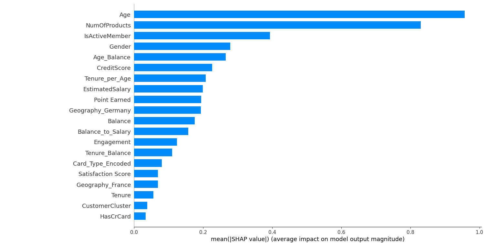
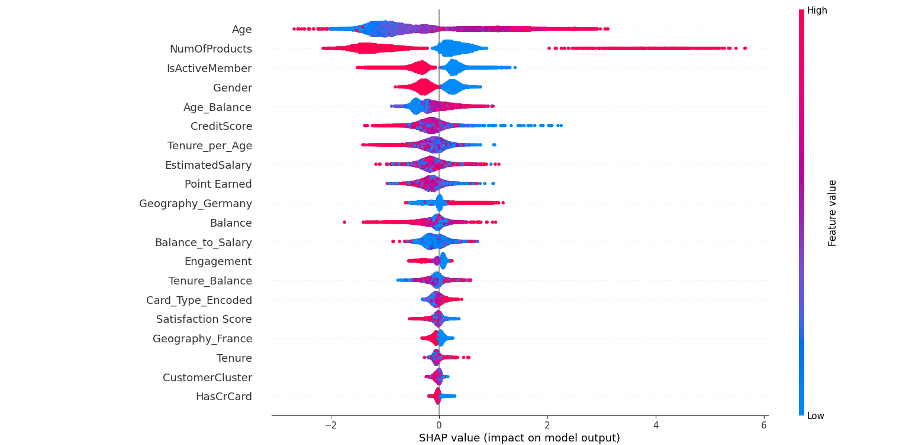
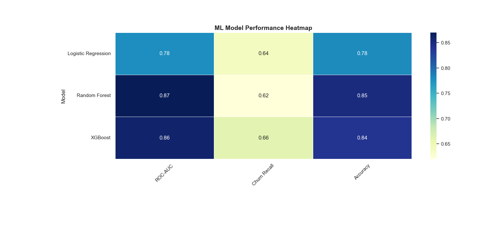
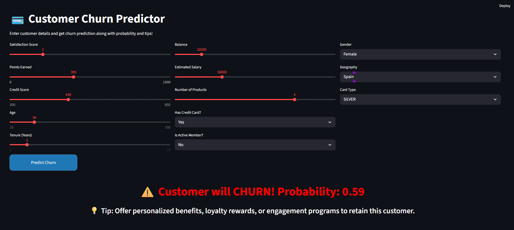
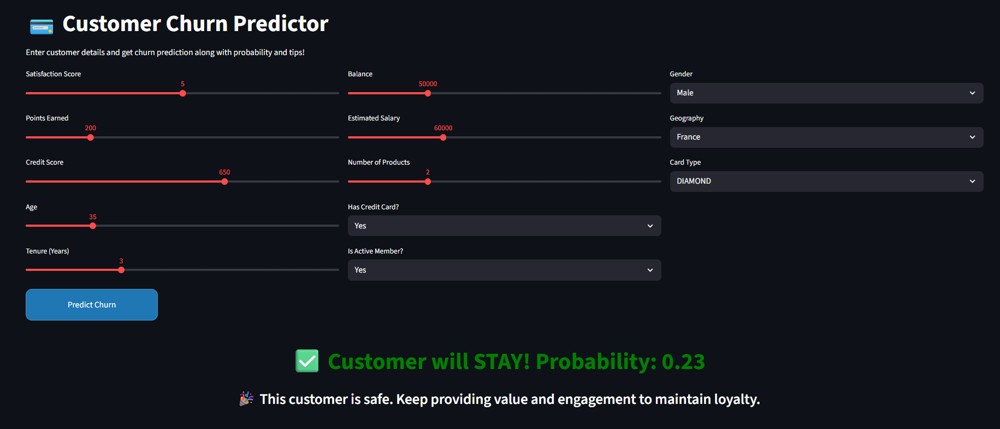

# Customer Churn Prediction

Predicting customer churn for a banking dataset using advanced machine learning techniques. This project demonstrates an end-to-end applied data science workflow including data preprocessing, advanced feature engineering, model training, evaluation, explainability, and interactive application development.

---

## Table of Contents
- Problem Statement
- Dataset
- Data Preprocessing & Feature Engineering
- Exploratory Data Analysis
- Models
- Feature Importance & Explainability
- Leaderboard
- Interactive Streamlit Demo
- Business Insights
- Future Work
- How to Run

---

## Problem Statement
Customer churn is a critical business metric for banks. Accurately identifying customers likely to leave enables proactive retention strategies and reduces revenue loss.

Goal: Build production-style machine learning models to predict customer churn and demonstrate real-world deployment capability.

---

## Dataset
- Banking dataset with 10,000 customers  
- Features include demographics, account activity, engagement indicators, and engineered behavioral metrics  
- Target variable:
  - Exited → 1 = Churned, 0 = Retained  

Engineered Features Include:
- Age_Balance  
- Tenure_per_Age  
- Balance_to_Salary  
- Engagement  
- CustomerCluster (KMeans segmentation)  

---

## Data Preprocessing & Feature Engineering

### Categorical Encoding
- Gender, Geography, Card Type  
- One-hot encoding and label encoding based on model requirements  

### Advanced Feature Engineering
- Behavioral ratios and interaction features  
- Customer segmentation using KMeans clustering  
- Engagement scoring based on activity patterns  

### Leakage Detection & Feature Validation
- Removed post-event or unrealistic predictors  
- Dropped leaky features:
  - Complain  
  - Risk_Score  
- Correlation analysis performed to validate feature safety  

---

## Exploratory Data Analysis
- Class imbalance observed:
  - Retained: 7,962  
  - Churned: 2,038  
- Distribution analysis of Geography, Gender, Card Type  
- Numerical feature histograms and correlation heatmaps  

---

## Models

| Model | Description |
|------|------------|
| Logistic Regression | Baseline interpretable classifier |
| Random Forest | Tree ensemble with hyperparameter tuning |
| XGBoost | Gradient boosting model for advanced tabular learning |

Evaluation Metrics Used:
- ROC-AUC  
- Accuracy  
- Recall for churn class (Exited = 1)  

---

## Feature Importance & Explainability

### Random Forest Feature Importance

### XGBoost SHAP Summary Plot

Key Observations:
- Age, product count, engagement metrics, and engineered ratio features strongly influence churn probability  
- Feature engineering significantly boosted predictive performance  

---

## Leaderboard

### Model Performance Comparison

| Model | ROC-AUC | Churn Recall | Accuracy |
|------|--------|-------------|----------|
| Random Forest | 0.870 | 0.62 | 0.85 |
| XGBoost | 0.860 | 0.66 | 0.84 |
| Logistic Regression | 0.778 | 0.64 | 0.78 |

Random Forest achieved the strongest overall performance on this dataset.

---

## Interactive Streamlit Demo

### High-Risk Customer Prediction (Churn Case)

### Low-Risk Customer Prediction (Retention Case)

Application Features:
- Slider-based numeric input controls  
- Automated backend feature engineering  
- Real-time churn probability output  
- Business-focused retention recommendations  
- Visual probability display for decision support  

---

## Business Insights
- Younger customers with fewer banking products show higher churn risk  
- Strong engagement and multi-product adoption reduce churn probability  
- Customer clustering enables targeted retention strategies  

---

## Future Work
- Early stopping and cross-validation tuning for XGBoost  
- Cloud deployment using Streamlit Community Cloud  
- Integration with real-time transaction pipelines  
- Advanced behavioral modeling  
- Customer lifetime value prediction  

---

